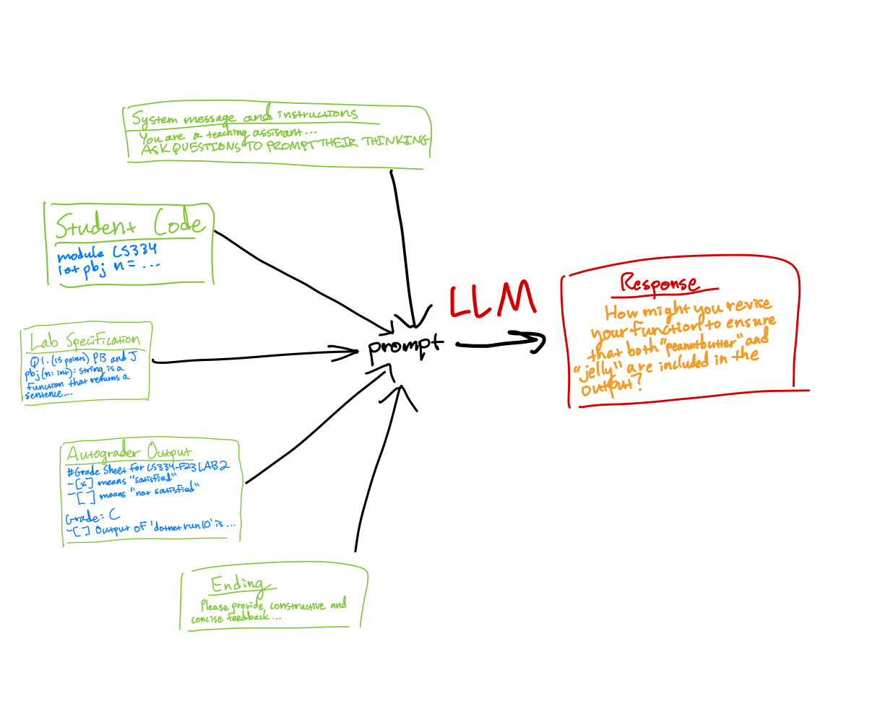

# llmTA
This project aims to see if large language models can behave as teaching assistants for a computer science class. Using the lab assignment specification, the student's code, the code for the autograder, and the autograder grade report, the model should generate some questions to prompt the student's thinking in the right direction.

## Quickstart
Download this project: `git clone https://github.com/ssocolow/llmta.git`  
Enter and install requirements: `cd llmta`, then `pip install -r requirements.txt`  
Make sure your OpenAI key is loaded as an environment variable: `echo $OPENAI_API_KEY` should show something like sk-lQr...  

Now, everything should be set up.  Here is a simple example:  
`python3 main.py tests/studentCode.txt tests/labspec.txt tests/gradeOutput.txt --model 4 --temperature 0.7 --short`  

Output:  
`Have you considered the scenario where n is divisible by both 3 and 5, and does your current implementation handle this case correctly according to the assignment specifications? If not, how might you revise your function to ensure that both "peanutbutter" and "jelly" are included in the output for such numbers?`  

## Notes
- GPT 4 turbo is higher quality than GPT 3.5 turbo but is much slower (42 seconds vs 11 seconds)

## Prompt Structure


## Command line options
```
usage: main.py [-h] [--unittestcode UNITTESTCODE] [--temperature TEMPERATURE] [--model MODEL] [--short] usercode spec result

positional arguments:
  usercode              user code file
  spec                  lab specification file
  result                grade report / unit test output file

optional arguments:
  -h, --help            show this help message and exit
  --unittestcode UNITTESTCODE
                        code that tests the student's code
  --temperature TEMPERATURE
                        temperature parameter of the llm
  --model MODEL         choose between gpt-4-1106-preview with '4' and gpt-3.5-turbo-1106 with '3'
  --short               only output short response
```
